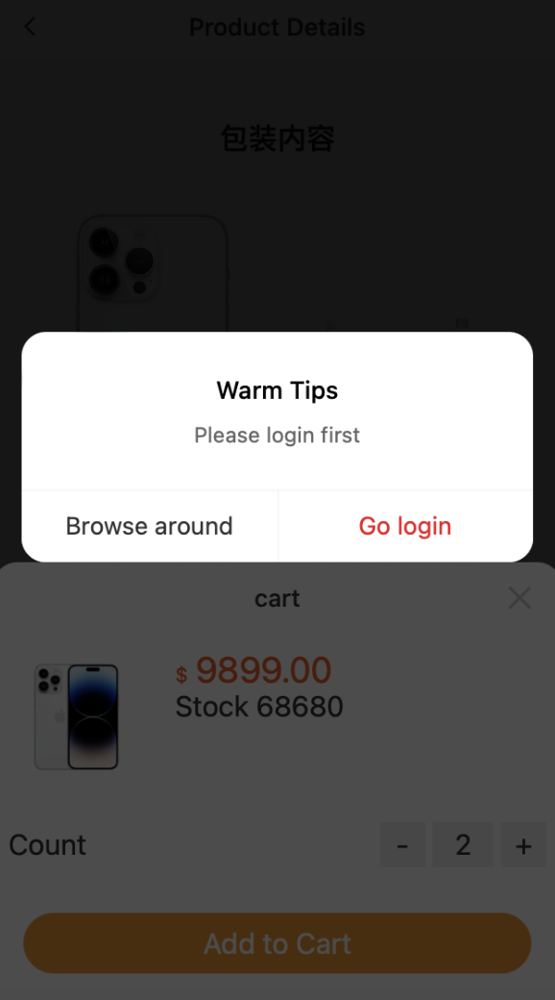

# Smart Mall - Mobile app

A Vue2 based shopping application on mobile

## Project setup
```
yarn install
```

### Compiles and hot-reloads for development
```
yarn serve
```

### Compiles and minifies for production
```
yarn build
```

### Lints and fixes files
```
yarn lint
```

### Customize configuration
See [Configuration Reference](https://cli.vuejs.org/config/).

# Introduction of features

### 1. Home page


### 2. Search bar

##### Show latest search history


### 3. Categories

##### Switch categories


### 4. Product page


### 5. Cart
##### Add to cart and change count

##### Cannot go to cart if not logging in

##### Sum up count number in carts


### 6. Checkout
##### Go buy now

##### Check out page

##### Select all or select single item


### 7. Confirm


### 8. Login


### 9. User page


